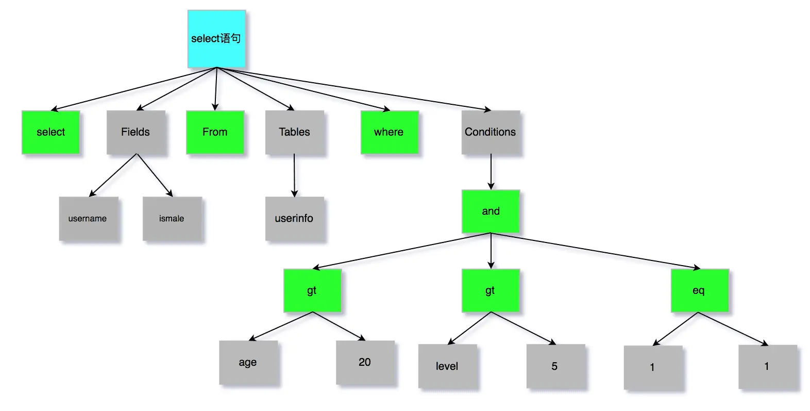
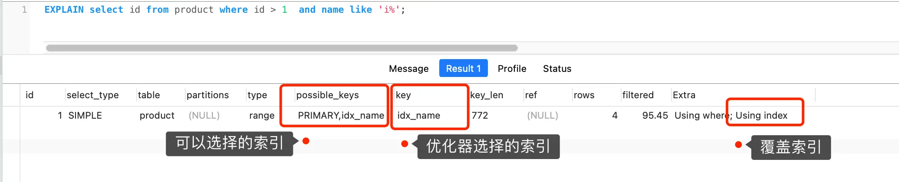

## 灵魂拷问
请你介绍一下这条Sql查询语句的执行过程？
```
select * from user where id = 1;
```

## Mysql的查询流程


从上面的流程图可以看出，Mysql的查询过程大致分为以下几个步骤：

Server层：
- 连接器：建立连接
- 解析分析器：分析处理SQL语句
- 执行器：执行SQL语句

存储引擎层：
- 数据存储：支持Innodb、Myisam等存储引擎，InnoDB在最新版本起为默认存储引擎
- 数据提取：根据条件遍历索引或数据页提取满足条件的数据（InnoDB引擎默认使用B+树索引）

根据上面初步认知，我们来一步步分析下Mysql的查询过程。
## 第一步：连接器
这个概念非常容易理解，就是建立连接的过程，例如在终端使用如下。
> mysql -h$ip -u$user -p

知识点如下：
- Mysql基于TCP协议进行通信，所以需要先建立TCP连接。
- 查看当前客户端连接数，执行命令：`show processlist;`，同时该命令也可以用来排查前正在执行的sql，根据返回的ID，可以kill掉对应的进程。

空闲连接是否一致占用
- Mysql控制空闲连接参数`wait_timeout`，默认是28800秒（8小时），如果超过该时间没有操作，则自动断开连接。
- 如果需要长时间连接，可以设置`wait_timeout=0`，或者使用长连接。

Mysql的连接数是否有限制
- Mysql控制连接数参数`max_connections`，默认是151个，超过该值，则拒绝连接，提示`Too many connections`。
- Mysql也有长连接和短连接的概念，这里推荐使用长连接，可以减少频繁建立连接和断开连接的开销。

长连接如何解决占用内存问题
- 定期释放长连接
- 客户端主动断开连接，执行命令：`mysql_reset_connection`，通过该函数来释放内存效果，过程中不需要重新连接和重新做权限验证，但是会恢复到刚刚创建完时的状态。
  
## 第二步：查询缓存器
  Mysql8.0之前，查询缓存器是默认开启的，但是从8.0开始，默认关闭了该功能。
  
  知识点如下：
  - 开启查询缓存器，需要设置`query_cache_type`参数，设置为1或2，1表示开启，2表示开启且对select语句进行缓存。
  - 查询缓存器会占用一定的内存空间，可以通过`query_cache_size`参数控制大小。
  - 查询缓存器只支持select语句，不支持insert、update、delete等操作。 查询缓存器会根据sql语句和参数生成一个key值，如果命中缓
  
## 第三步：解析分析器
1、词法

  根据输入字符串分析出关键字，例如`select name from user where id = 1`，关键字包括selec、from、where等。

2、语法分析

构建语法树，方便后续获取SQL类型和表名、列名等。

如果sql语句有语法错误，则解析分析器会报错。但是字段不存在或不对，并不是解析器判断，该判断是在预处理器过程中判断。

## 第四步：执行器
执行过程中三个阶段
- prepare: 预处理器，进行语法分析
- optimize: 优化器，根据索引选择最优方案
- execute: 执行器，执行查询

### 预处理器
两件小事
- 检查 SQL 查询语句中的表或者字段是否存在；
- 将 `select *` 中的 `*` 符号，扩展为表上的所有列
  
### 优化器
优化器：为SQL 查询语句先制定一个执行计划，主要是基于查询成本，选择最优的执行方案，而不是简单用主键索引。

通过explain命令查看执行计划，例如`explain select * from user where id = 1;`

执行过程中使用了普通索引（name），Exta 为 Using index，这就是表明使用了覆盖索引优化（不需要回表），因为查询主键索引B+树成本比二级索引B+树成本大，优化器选择代价小普通索引。

### 执行器
执行器和存储引擎交互过程
- 主键索引查询
- 全表扫描
- 索引下推


主键索引查询
- 访问类型const
- 执行器查询的过程是一个 while 循环，所以还会再查一次，但是这次因为不是第一次查询了，所以会调用 read_record 函数指针指向的函数，因为优化器选择的访问类型为 const，这个函数指针被指向为一个永远返回 - 1 的函数，所以当调用该函数的时候，执行器就退出循环，也就是结束查询了。

全表扫描
> select * from product where name = 'iphone';
- 访问类型为all，执行器第一次查询，会调用 read_first_record 函数指针指向的函数，函数指针被指向为 InnoDB 引擎全扫描的接口，让存储引擎读取表中的第一条记录
- 执行器会判断读到的这条记录的 name 是不是 iphone，如果不是则跳过；如果是则将记录发给客户的（是的没错，Server 层每从存储引擎读到一条记录就会发送给客户端，之所以客户端显示的时候是直接显示所有记录的，是因为客户端是等查询语句查询完成后，才会显示出所有的记录）。
- 执行器查询的过程是一个 while 循环，所以还会再查一次，执行器收到存储引擎报告的查询完毕的信息，退出循环，停止查询。

索引下推
> select * from t_user  where age > 20 and reward = 100000;
- 联合索引当遇到范围查询 (>、<) 就会停止匹配，也就是 age 字段能用到联合索引，但是 reward 字段则无法利用到索引
- Server 层首先调用存储引擎的接口定位到满足查询条件的第一条二级索引记录，也就是定位到 age > 20 的第一条记录；
- 存储引擎定位到二级索引后，先不执行回表操作，而是先判断一下该索引中包含的列（reward列）的条件（reward 是否等于 100000）是否成立。如果条件不成立，则直接跳过该二级索引。如果成立，则执行回表操作，将完成记录返回给 Server 层。
- Server 层在判断其他的查询条件（本次查询没有其他条件）是否成立，如果成立则将其发送给客户端；否则跳过该记录，然后向存储引擎索要下一条记录。
- 如此往复，直到存储引擎把表中的所有记录读完。

## 总结
Mysql的执行过程

- 连接器：建立连接，管理连接、校验用户身份；
- 查询缓存：查询语句如果命中查询缓存则直接返回，否则继续往下执行。MySQL 8.0 已删除该模块；
- 解析 SQL，通过解析器对 SQL 查询语句进行词法分析、语法分析，然后构建语法树，方便后续模块读取表名、字段、语句类型；
- 执行 SQL：执行 SQL 共有三个阶段：
    - 预处理阶段：检查表或字段是否存在；将 select * 中的 * 符号扩展为表上的所有列。
    - 优化阶段：基于查询成本的考虑， 选择查询成本最小的执行计划；
    - 执行阶段：根据执行计划执行 SQL 查询语句，从存储引擎读取记录，返回给客户端；
  
参考资料：
- 《MySQL 45 讲》
- https://xiaolincoding.com/mysql/base/how_select.html