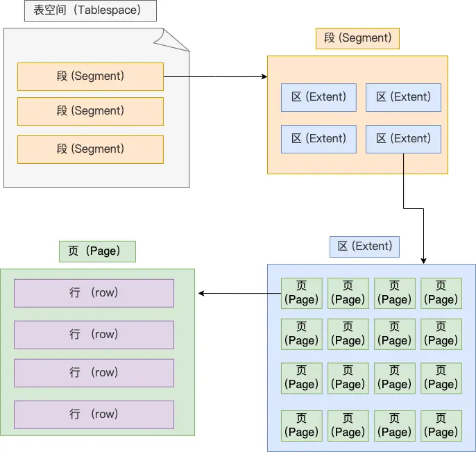

## 灵魂拷问
- MySQL 的 NULL 值会占用空间吗？
- MySQL 怎么知道 varchar(n) 实际占用数据的大小？
- varchar(n) 中 n 最大取值为多少？
- 行溢出后，MySQL 是怎么处理的？

## Mysql文件放在哪里

- db.opt，用来存储当前数据库的默认字符集和字符校验规则。
- .frm 存储表结构。该文件是用来保存每个表的元数据信息的，主要包含表结构定义。
- idb 存储表数据。表数据既可以存在共享表空间文件（文件名：ibdata1）里，也可以存放在独占表空间文件（文件名：表名字.ibd）。这个行为是由参数 innodb_file_per_table 控制的，若设置了参数 innodb_file_per_table 为 1，则会将存储的数据、索引等信息单独存储在一个独占表空间，从 MySQL 5.6.6 版本开始，它的默认值就是 1 了，因此从这个版本之后， MySQL 中每一张表的数据都存放在一个独立的 .ibd 文件。后面mysql 8 版本，都合并到 ibd中

### 表空间结构

- 行：数据按行存储，并且有不同的行格式（重点）

- 页：数据库按页读取数据，InnoDB 的数据是按「页」为单位来读写的[按行读非常浪费IO]，默认每页16Kb。页是 InnoDB 存储引擎磁盘管理的最小单元，意味着数据库每次读写都是以 16KB 为单位的，一次最少从磁盘中读取 16K 的内容到内存中，一次最少把内存中的 16K 内容刷新到磁盘中。
页的类型有很多，常见的有数据页、undo 日志页、溢出页等等。

- 区：为了解决B+数各层中要维持双向链表，避免相邻的页间隔大，造成大量的随机Io,就吧相邻的页划为一个区，查询的时候就可以顺序Io
在表中数据量大的时候，为某个索引分配空间的时候就不再按照页为单位分配了，而是按照区（extent）为单位分配。每个区的大小为 1MB，对于 16KB 的页来说，连续的 64 个页会被划为一个区，这样就使得链表中相邻的页的物理位置也相邻，就能使用顺序 I/O 了。

- 段：表空间是由各个段（segment）组成的，段是由多个区（extent）组成的。段一般分为数据段、索引段和回滚段等。

  - 索引段：存放 B + 树的非叶子节点的区的集合；
  - 数据段：存放 B + 树的叶子节点的区的集合；
  - 回滚段：存放的是回滚数据的区的集合，MVCC 借助回滚段实现多版本查询
  
### Innodb行格式

### 记录的真实数据：
三个隐藏字段，分别为：row_id、trx_id、roll_pointer，

row_id 表中没有主见或者唯一约束列，Innodb会添加row_id列row_id不是必需的，占用 6 个字节。
事务id，表示这个数据是由哪个事务生成的。 trx_id是必需的，占用 6 个字节。
roll_pointer 这条记录上一个版本的指针。roll_pointer 是必需的，占用 7 个字节。如果你熟悉 MVCC 机制，你应该就清楚 trx_id 和 roll_pointer 的作用了

### varchar（n） 中 n 的最大值是多少
MySQL 规定除了 TEXT、BLOBs 这种大对象类型之外，其他所有的列（不包括隐藏列和记录头信息）占用的字节长度加起来不能超过 65535 个字节。
varchar(n) 字段类型的 n 代表的是最多存储的字符数量，并不是字节大小。所以能n最大值，需要根据不同的字符集判断。
一行数据的最大字节数是 65535（不包含 TEXT、BLOBs 这种大对象类型），其中包含了 storage overhead

## 行溢出后，mysql如何处理

## 总结
- MySQL 的 NULL 值是怎么存放的？
  - Compact 行格式下，NULL 占用一个字节，如果列允许 NULL 值，则该列的记录头信息中会设置一个标记位，表示该列是否为 NULL，当表都定义成NOT NULL 时，行格式就不会有NULL值系列，节省1字节空间
- varchar(n) 中 n 最大取值为多少？
  - 65535
- MySQL 怎么知道 varchar(n) 实际占用数据的大小？
  - 用Compact行格式存储，记录头信息中记录了实际存储的字符长度
参考
- 
- https://juejin.cn/post/7097040621210173454