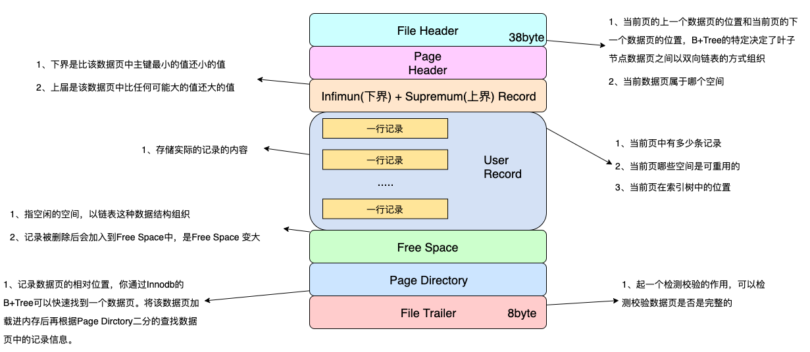
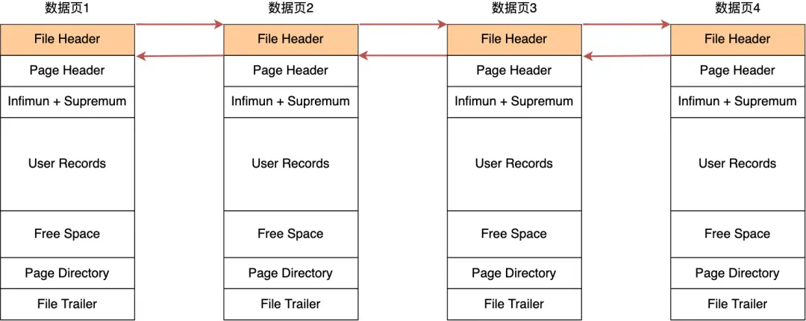
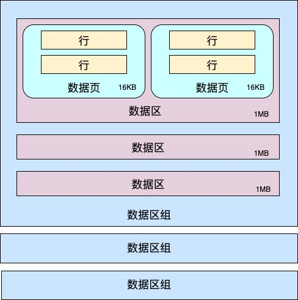
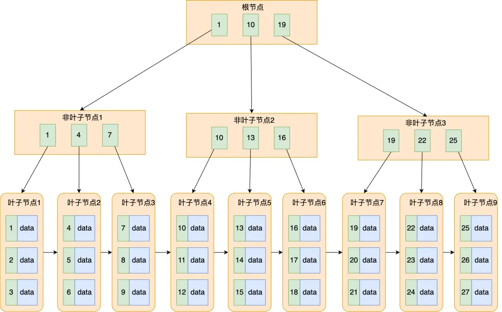

#### 基本概念

磁盘读写最小单位是扇区，扇区大小只有512B，InnoDB从磁盘中读取数据的最小单位是数据页，数据页大小是16KB。当需要读一条记录的时候，并不是将这个记录本身从磁盘读出来，而是以页为单位，将其整体读入内存。一旦索引页被加载到内存中，MySQL 会使用索引来快速定位数据所在的页（数据页）。索引提供了一种高效的方式来查找数据，而不需要扫描整个表。索引页是存储索引的基本单位。

#### 数据页长啥样？

在File Header中，有两个指针：分别指向下一个和上一个数据页。

- 采用链表结果是为了让数据页之间不需要物理连续，只需要逻辑上的连续。

#### 什么是数据区？
在MySQL的设定中，同一个表空间内的一组连续的数据页为一个extent（区），默认区的大小为1MB，页的大小为16KB。16*64=1024，也就是说一个区里面会有64个连续的数据页。连续的256个数据区为一组数据区。

前面讲过，数据是保存在磁盘上，我们希望尽可能减少对磁盘的IO操作，因为磁盘IO操作是计算机中最慢的操作之一。

所以我们希望设计这样适合Mysql的索引结构，满足以下条件
- 尽可能减少磁盘IO操作
- 高效查询某一条数据记录，同时也高效执行范围查找

#### B树
B-树是一种多路自平衡的搜索树 它类似普通的平衡二叉树()，不同的一点是B-树允许每个节点有更多的子节点。B-Tree 相对于 AVLTree 缩减了节点个数，使每次磁盘 I/O 取到内存的数据都发挥了作用，从而提高了查询效率。I/O渐进复杂度为O(h)

#### B+树
B+ 树就是对 B 树做了一个升级

B+树和B树的区别在于
- B+树的非叶子节点不存储数据，只存储索引。
- 所有的索引都会存放在叶子节点，叶子节点直接构成一个有序的链表
- 非叶子节点有几个子节点，就代表有多少个索引
- 非叶子节点索引同时存在子节点中，并且是子节点中索引的最大值或最小值

参考
- 一看就懂的：MySQL数据页以及页分裂机制：https://www.cnblogs.com/ZhuChangwu/p/14041410.html