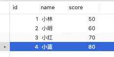

## 1. 什么是幻读
在MySQL数据库中，幻读是指在一个事务中，由于其他事务的并发操作，导致同一个查询在不同时间点返回不同的结果集。简单来说，幻读就是一个事务在读取数据的过程中，发现了一些“幻影”数据，这些数据在事务开始时不存在，但在事务结束时却突然出现了

## 2.快照读是怎么避免幻读
可重复读隔离级是由 MVCC(多版本并发控制)实现的，实现的方式是开始事务后(执行 begin 语句后)，在执行第一个查询语句后，会创建一个 Read View，后续的查询语句利用这个 Read View，通过这个 Read View 就可以在 undo log 版本链找到事务开始时的数据，所以事务过程中每次查询的数据都是,样的，即使中途有其他事务插入了新纪录，是查询不出来这条数据的，所以就很好了避免幻读问题。

做个实验，数据库表 t stu 如下，其中id 为主键,

## 3.当前读是怎么避免幻读
MVSQL 里除了普通查询是快照读，其他都是当前读，比如 update、insert、delete，这些语句执行前都会查询最新版本的数据，然后再做进一步的操作。

这很好理解，假设你要 update 一个记录，另一个事务已经 delete 这条记录并且提交事务了，这样不是会产生冲突吗，所以 update 的时候肯定要知道最新的数据。

另外， select ... for update 这种查询语句是当前读，每次执行的时候都是读取最新的数据

这时候，事务 B插入的记录，就会被事务A的第二条查询语句查询到(因为是当前读)，这样就会出现前后两次查询的结果集合不一样，这就出现了幻读。

所以，Innodb 引擎为了解决「可重复读」隔离级别使用「当前读」而造成的幻读问题，就引出了间隙锁。

事务A执行了这面这条锁定读语句后，就在对表中的记录加上id 范围为(2,+∞]的 next-key lock(next-key lock 是间隙锁+记录锁的组合)。

然后，事务B在执行插入语句的时候，判断到插入的位置被事务A加了 next-key lock，于是事物 B 会生成一个插入意向锁，同时进入等待状态，直到事务A提交了事务。这就避免了由于事务 B插入新记录而导致事务 A 发生幻读的现象,

## 4.完全解决了幻读了吗
可重复读虽然避免了大部分情况下幻读，但是还是无法完全避免幻读。

1、事务A查询id=5，没有记录

2、事务B插入一条id=5的记录

3、事务A更新id=5的记录，再次查询，发现id=5的记录

在可重复读隔离级别下，事务A第一次执行普通的 select 语句时生成了一个 ReadView，之后事务B向表中新插入了一条 id=5的记录并提交。接着，事务A对id=5 这条记录进行了更新操作，在这个时刻，这条新记录的 trx id 隐藏列的值就变成了事务 A的事务 id，之后事务 A 再使用普通 select 语句去查询这条记录时就可以看到这条记录了，于是就发生了幻读。

第二个发生幻读现象的场景

除了上面这一种场景会发生幻读现象之外，还有下面这个场景也会发生幻读现象。

- T1 时刻:事务A先执行「快照读语句」:select*fromt_test where id>100 得到了3条记录。- T2 时刻:事务 B往插入一个id= 200 的记录并提交;
- T3 时刻:事务A再执行「当前读语句」 select* from t_test where id>100 for update 就会得到 4条记录，此时也发生了幻读现象。

## 总结
要避免这类特殊场景下发生幻读的现象的话，就是尽量在开启事务之后，马上执行 select .. for update这类当前读的语句，因为它会对记录加 next-key lock，从而避免其他事务插入一条新记录。
