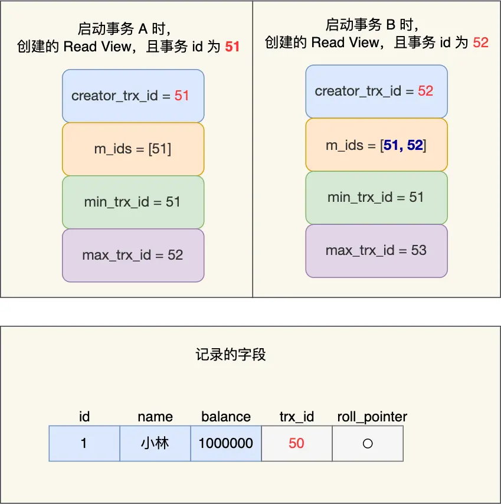

## 事务的特性
事务的ACID四个特性
- 原子性（Atomicity）：事务是一个不可分割的整体，要么全部成功，要么全部失败
- 一致性（Consistency）：事务开始时和结束时，数据库的数据完整性不会被破坏
- 隔离性（Isolation）：在并发操作中，每个事务相互隔离，不会相互影响
- 持久性（Durability）：事务完成后，该事务对数据操作保存在数据库中，不会被回滚

InnoDB引擎是如何保障事务的ACID特性？
- 持久性通过redo log（重做日志）保证
- 原子性通过undo log（回滚日志）保证
- 隔离性通过MVCC（多版本并发控制）保证
- 一致性通过持久性和隔离性和原子性保证

## 并发事务带来的问题
1、脏读(读取未提交数据)
脏读指的是读到了其他事务未提交的数据，未提交意味着这些数据可能会回滚，也就是可能最终不会存到数据库中，也就是不存在的数据。读到了并一定最终存在的数据，这就是脏读

2、不可重复读(前后多次读取，数据内容不一致)
一个事务内两个相同的查询却返回了不同数据。这是由于查询时系统中其他事务修改的提交而引起的。

3、幻读(前后多次读取，数据总量不一致)
在一个事务内多次查询某个符合查询条件的「记录数量」，如果出现前后两次查询到的记录数量不一样的情况，就意味着发生了「幻读」现象。

## 事务隔离级别
（1）read uncommitted（ 读取尚未提交的数据 ：不解决脏读，允许脏读，其他事务只要修改了数据未提交也能读取），即使未提交，本事务也能看到修改后的数据值。也就是可能读取到其他会话中未提交事务修改的数据。

- 安全性最差   但性能最好 （不使用）
- 三种并发问题都没解决。

（2）read committed（提交读）：读取已经提交的数据 ：可以解决脏读

只能读取到已经提交的数据。
Oracle等多数数据库默认都是该级别〈不重复读)。
安全性较差  性能较好  （oracle 数据库 默认就是这种）

（3）repeatable read（可重复度）：重读读取：可以解决脏读 和 不可重复读

mysql默认的可重复读。
无论其他事务是否修改并提交了数据，在这个事务中看到的数据值始终不受其他事务影响
安全性较高，性能较差 （mysql 默认的就是这种）

（4）serializable：串行化：可以解决脏读、不可重复读和虚读

相当于锁表
完全串行化的读，每次读都需要获得表级共享锁，读写相互都会阻塞。
安全性高  、性能差 （ 不使用）

读已提交和可重复读隔离级别的事务来说，它们是通过 Read view 来实现的，它们的区别在于创建 Read View 的时机不同，大家可以把 Read View 理解成一个数据快照，就像相机拍照那样定格某一时刻的风景。「读提交」隔离级别是在「每个语句执行前」都会重新生成一个 Read View,而「可重复读」隔离级别是「启动事务时」生成一个 Read View，然后整个事务期间都在用这个 ReadView.

## Read View是如何工作
Read View 记录了当前系统中存在哪些快照数据，以及这些快照数据何时生效的。

Read View 有四个重要的字段

- m_ids:指的是在创建 Read View 时，当前数据库中「活跃事务」的事务 id 列表，注意是一个列表，“活跃事务"指的就是，启动了但还没提交的事务,
- min_trx_id:指的是在创建 Read View 时，当前数据库中「活跃事务」中事务 id 最小的事务，也就是m ids 的最小值。
- max_trx _id : 这个并不是 m_ids 的最大值，而是创建 Read View 时当前数据库中应该给下一个事务的id 值，也就是全局事务中最大的事务 id 值 +1:
- creator trx id : 指的是创建该 Read View 的事务的事务 id

除了这四个字段之外，Read View 还有两个属性：

- trx_id:当事务对某个数据进行更改时，会把该数据行的 trx_id 设置为当前事务的 id 值
- roll_pointer：每次对某条聚簇索引记录进行改动时，都会把旧版本的记录写入到 undo 日志中，然后这个隐藏列是个指针，指向每一个旧版本记录，于是就可以通过它找到修改前的记录。

创建trx_id三种情况

对于当前事务的启动瞬间来说，读取的一个数据版本的trx_id，有以下几种可能：

- 如果被访问版本的trx_id属性值与ReadView中的 creator_trx_id 值相同，意味着当前事务在访问它自己修改过的记录，所以该版本可以被当前事务访问。
- 如果落在绿色部分，表示这个版本是已提交的事务或者是当前事务自己生成的，这个数据是可见的；
- 如果落在红色部分，表示这个版本是由将来启动的事务生成的，是肯定不可见的；
如果落在黄色部分，那就包括两种情况
- 若 数据的trx_id在trx_ids数组中，表示这个版本是由还没提交的事务生成的，不可见, 去读取这条数据的历史版本，这条数据的历史版本中都包含了事务id信息，去查找第一个不在活跃事务数组的版本记录。
- 若 数据的trx_id不在trx_ids数组中，表示这个版本是已经提交了的事务生成的，可见。
这种通过版本链 + 一致性视图 来控制并发事务访问同一个记录时的行为就叫 MVCC（多版本并发控制）

## 读已提交是如何工作

我们来分析下为什么事务 B第二次读数据时，读不到事务 A(还未提交事务)修改的数据?

事务B在找到小林这条记录时，会看这条记录的 trx id 是 51，在事务B的 Read View的 min_trx id 和max trx id 之间，接下来雲要判断 trx id 值是否在 m ids 范围内，判断的结果是在的，那么说明这条记录是被还未提交的事务修改的，这时事务 B并不会读取这个版本的记录。而是，沿着 undo log 链条往下找旧版本的记录，直到找到 trx id 「小于」事务B的 Read View 中的 min_trx_id 值的第一条记录，所以事务 B 能读取到的是 trx id 为 50 的记录，也就是小林余额是 100 万的这条记录。
我们来分析下为什么事务 A 提交后，事务 B 就可以读到事务 A 修改的数据?

在事务 A 提交后，由于隔离级别是「读提交」，所以事务 B在每次读数据的时候，令会重新创建 Readview，此时事务 B第三次读取数据时创建的 Read View 如下:

事务 B在找到小林这条记录时，会发现这条记录的 trx id 是 51，比事务B的 Read View 中的min trx id 值(52)还小，这意味着修改这条记录的事务早就在创建 Read View 前提交过了，所以该版本的记录对事务 B 是可见的。

正是因为在读提交隔离级别下，事务每次读数据时都重新创建 Read View，那么在事务期间的多次读取同一条数据，前后两次读的数据可能会出现不一致，因为可能这期间另外一个事务修改了该记录，并提交了事务。

## 可重复读是如何工作

事务 A 和 事务 B 的 Read View 具体内容如下:

在事务 A的 Read View 中，它的事务 id 是 51，由于它是第一个启动的事务，所以此时活跃事务的事务 id 列表就只有 51，活跃事务的事务 id 列表中最小的事务 id 是事务 A 本身，下一个事务 id 则是52。

在事务B的 Read view 中，它的事务id 是 52、由于事务A是活跃的，所以此时活跃事务的事务id 列。
表是 51 和 52，活跃的事务 id 中最小的事务 id 是事务 A，下一个事务 id 应该是 53。

事务 B第一次读小林的账户余额记录，在找到记录后，它会先看这条记录的 trx_id，此时发现 trx id 为50，比事务B的 Read View 中的 min trx id 值(51)还小，这意味着修改这条记录的事务早就在事务B 启动前提交过了，所以该版本的记录对事务B可见的，也就是事务 B可以获取到这条记录。

接着，事务 A 通过 update 语句将这条记录修改了(还未提交事务)，将小林的余额改成 200 万，这时MySQL 会记录相应的 undo log，并以链表的方式串联起来，形成版本链，如下图:

你可以在上图的「记录的字段」看到，由于事务A 修改了该记录，以前的记录就变成旧版本记录了，于是最新记录和旧版本记录通过链表的方式串起来，而且最新记录的 trx_id 是事务 A的事务 id(trx_id =51)。

然后事务 B第二次去读取该记录，。发现这条记录的 trx id 值为 51，在事务 B的 Read View 的min trx id 和 max trx id 之间，则需要判断 trx id 值是否在 m ids 范围内，判断的结果是在的，那么说明这条记录是被还未提交的事务修改的，这时事务B并不会读取这个版本的记录。而是沿着 undo log链条往下找旧版本的记录，直到找到 trx id 「小于」事务 B的 Read View 中的 min trx id 值的第一条记录，所以事务B能读取到的是 trx id 为 50 的记录，也就是小林余额是 100 万的这条记录。

最后，当事物 A提交事务后，由于隔离级别时「可重复读」，所以事务 B再次读取记录时，还是基于启动事务时创建的 Read view 来判断当前版本的记录是否可见。所以，即使事物 A将小林余额修改为 200 万并提交了事务， 事务 B第三次读取记录时，读到的记录都是小林余额是 100 万的这条记录
就是通过这样的方式实现了，「可重复读」隔离级别下在事务期间读到的记录都是事务启动前的记录

## 总结
在可重复读隔离级别中，普通的 select 语句就是基于 MVCC 实现的快照读，也就是不会加锁的。select..for update 语句就不是快照读了，而是当前读了，也就是每次读都是拿到最新版本的数据，但是它会对读到的记录加上 next-key lock 锁。