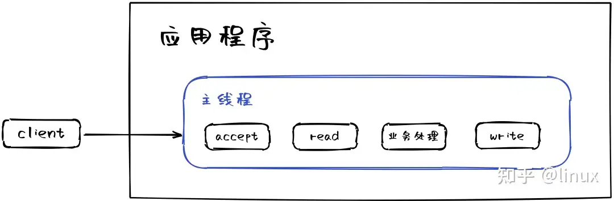
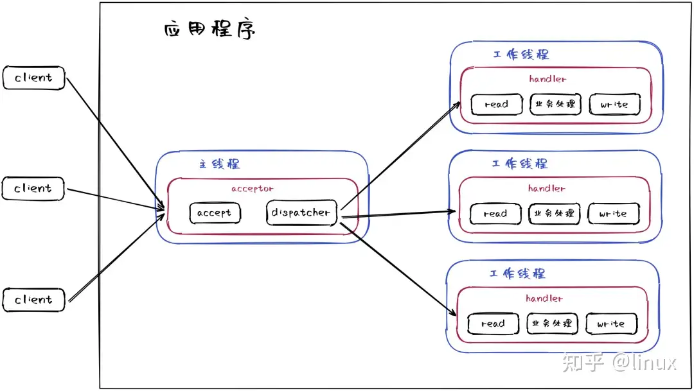
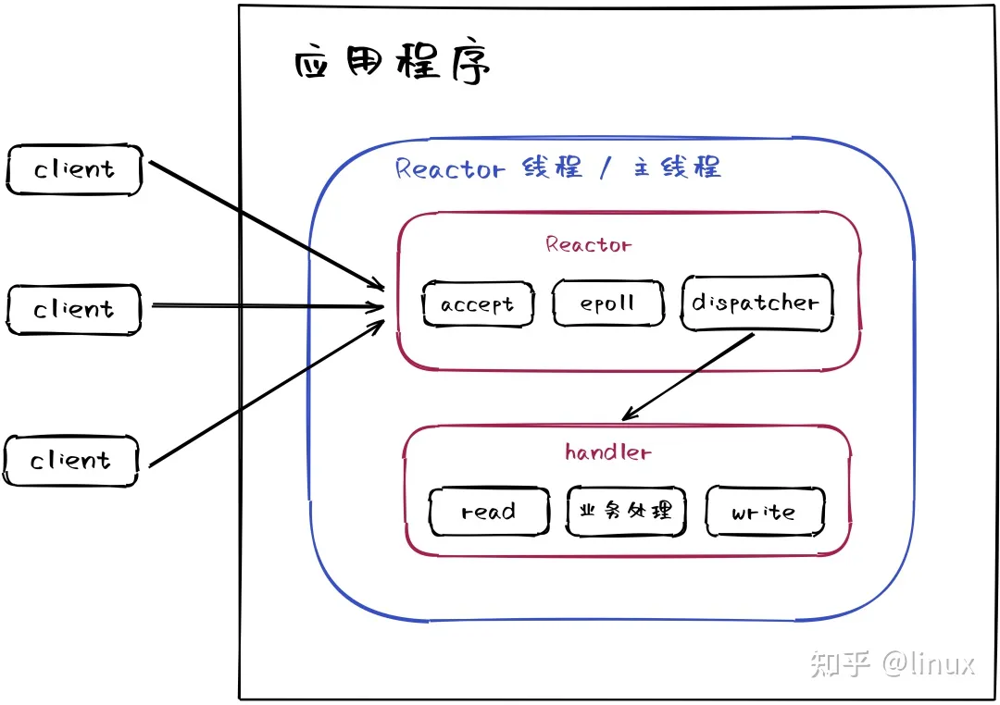
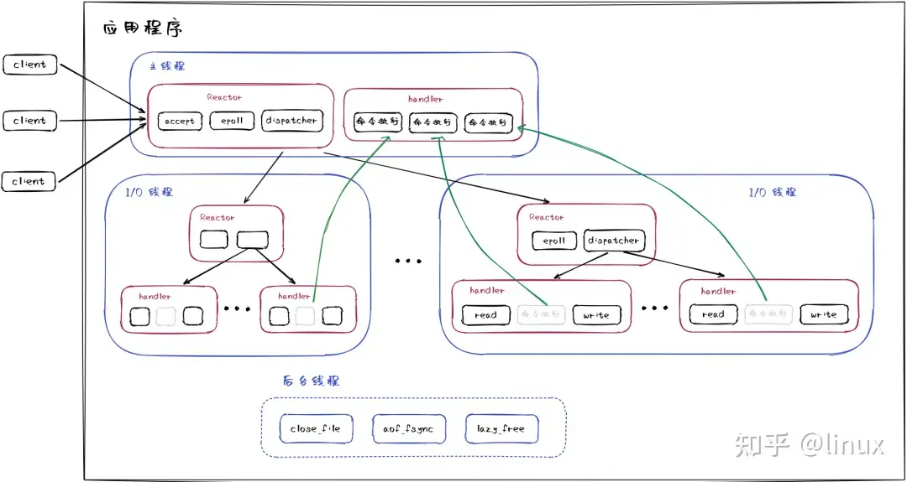

大家在日常使用Redis的过程中，有没有想过为什么Redis是单线程的，又为什么6.0之后才引入多线程？

### 什么是线程模型

#### 阻塞IO单线程

该模型一次只能处理一个客户端的请求，整个流程是串行，如果客户端请求过多，就会导致服务器响应缓慢。

进化版本

- 主线程完成建立连接，将连接句柄交给工作线程
- 工作线程负责数据读取、业务处理，以及数据回复等操作
  
缺点
- 请求量大需要额外的线程调度，系统资源占用大
- 建立连接后，当前线程如果没有数据可读，会导致线程阻塞，造成线程资源浪费
  

#### Reactor模型

单线程

- 采用IO多路复用机制，将客户端的请求注册到事件循环中
- 没有多线程的调度，所有操作都在主线程中完成
  
缺点
- 无法充分利用多核CPU，只能单线程处理
- 线程容易跑飞（内存错误、指令错误、外部干扰等）

#### Redis多线程
核心网络模型引入多线程

- 多线程网络模型
- 多线程后台任务
Redis 的多线程模型却并非上面介绍的标准 Reactor 多线程模型。因为 Redis 的 I/O threading 只负责 I/O 读写，不负责命令执行。所以，Redis 其实是将读取客户端请求命令和回写响应数据的逻辑异步化了，实际命令的执行最终还是在主线程上完成

参考
- [深入Redis 线程模型](https://zhuanlan.zhihu.com/p/639750217)